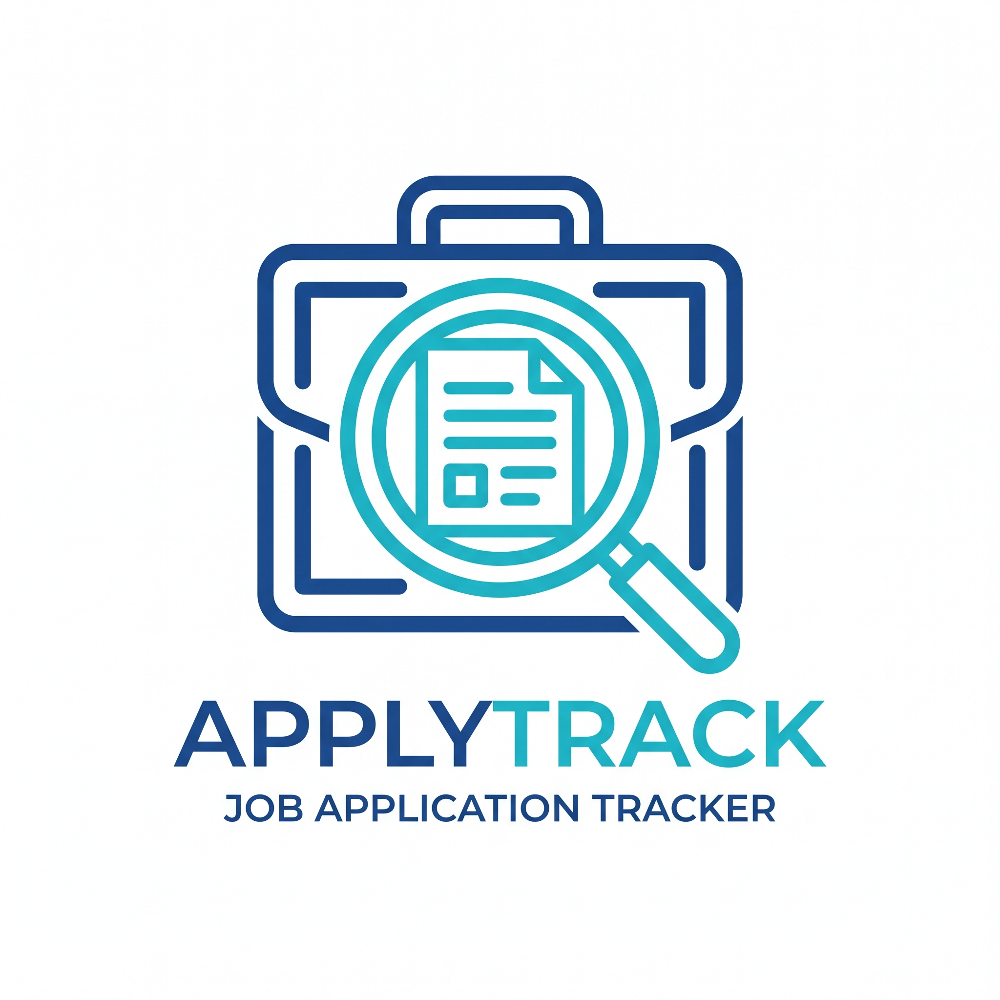

# APPLYTRACK — Job Application Tracker

<table>
  <tr>
    <td width="100" valign="top">
      
    </td>
    <td valign="middle">
A modern, full-stack application designed to help users track their job applications through a clean, intuitive Kanban-style board. Built with the Next.js App Router, this project leverages server-side rendering, server actions, and a robust backend to provide a seamless user experience.
    </td>
  </tr>
</table>

## Live Demo

https://job-application-tracker-chi-opal.vercel.app/

## Features

- **User Authentication**: Secure sign-up and sign-in functionality using email and password.
- **Kanban Board**: A drag-and-drop interface to manage job applications across different stages (e.g., "Applied", "Interviewing", "Offer").
- **CRUD Operations**: Create, read, update, and delete job applications.
- **Responsive Design**: A mobile-first and fully responsive layout built with Tailwind CSS.
- **Server-Side Logic**: Efficient data fetching and mutations handled by Next.js Server Actions.
- **Database Integration**: MongoDB for persistent data storage, connected via Mongoose.

## Tech Stack

- **Framework**: [Next.js](https://nextjs.org/) (App Router)
- **Language**: [TypeScript](https://www.typescriptlang.org/)
- **Authentication**: [Better Auth](https://better-auth.dev/)
- **Database**: [MongoDB](https://www.mongodb.com/) with [Mongoose](https://mongoosejs.com/)
- **Styling**: [Tailwind CSS](https://tailwindcss.com/)
- **UI Components**: [Shadcn/UI](https://ui.shadcn.com/)
- **Drag & Drop**: [Dnd Kit](https://dndkit.com/)
- **Icons**: [Lucide React](https://lucide.dev/)

## Folder Structure

The project follows a feature-colocated structure within the `app` directory, promoting scalability and maintainability.

```
job-application-tracker/
├── app/
│   ├── (auth)/         # Route group for authentication pages
│   │   ├── sign-in/
│   │   └── sign-up/
│   ├── dashboard/      # Main application dashboard with the Kanban board
│   ├── api/            # API routes, including auth endpoints
│   ├── layout.tsx      # Root layout
│   └── page.tsx        # Landing/home page
├── components/
│   ├── ui/             # Reusable UI components from Shadcn/UI
│   └── *.tsx           # Application-specific components
├── lib/
│   ├── actions/        # Next.js Server Actions for data mutations
│   ├── auth/           # Authentication configuration and client setup
│   ├── hooks/          # Custom React hooks
│   ├── models/         # Mongoose schemas for database models
│   └── *.ts            # Utility functions and database connection
├── public/             # Static assets
└── scripts/            # Scripts for database seeding, etc.
```

## Getting Started

Follow these steps to set up and run the project locally.

### Prerequisites

- [Node.js](https://nodejs.org/en/) (v18 or later)
- [pnpm](https://pnpm.io/installation) (or npm/yarn)
- A MongoDB database (local or cloud-hosted via [MongoDB Atlas](https://www.mongodb.com/cloud/atlas))

### 1. Clone the Repository

```bash
git clone https://github.com/your-username/job-application-tracker.git
cd job-application-tracker
```

### 2. Install Dependencies

```bash
pnpm install
```

### 3. Set Up Environment Variables

Create a `.env.local` file in the root of the project and add the following variables.

```env
# MongoDB Connection String
MONGODB_URI="your_mongodb_connection_string"

# Better Auth Secret (generate a secure random string)
# openssl rand -base64 32
BETTER_AUTH_SECRET="your_auth_secret"

# The base URL of your application for local development
BETTER_AUTH_URL="http://localhost:3000"
NEXT_PUBLIC_BETTER_AUTH_URL="http://localhost:3000"
```

### 4. Run the Development Server

```bash
pnpm dev
```

The application will be available at [http://localhost:3000](http://localhost:3000).


